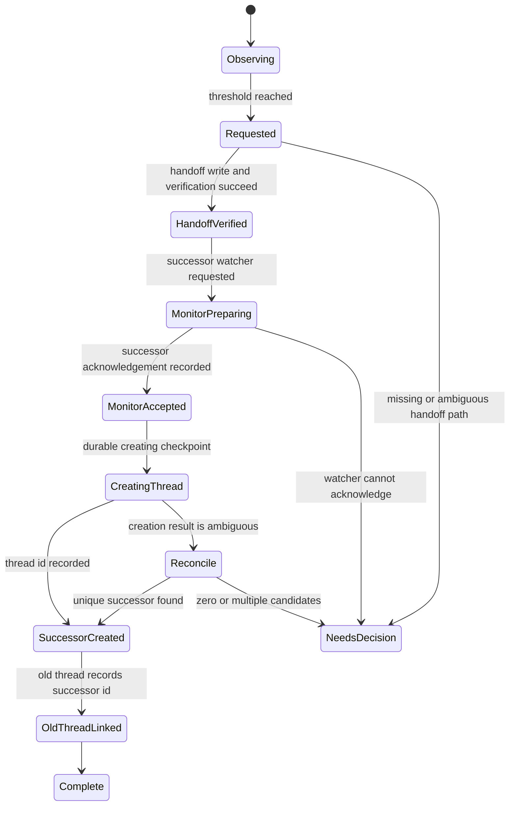

# Design

## Outcome

Rollover is a controlled ownership transfer, not merely "open a new thread."
The old thread remains authoritative until the successor has accepted the
handoff and CI watcher.

## Measurement

The normalized snapshot is:

```text
ContextSnapshot {
  threadId
  turnId
  activeContextTokens
  accumulatedSessionTokens
  modelContextWindow
  rawRemainingTokens
  effectiveRemainingPercent
  observedAt
  source
}
```

Use:

```text
activeContextTokens      = tokenUsage.last.totalTokens
accumulatedSessionTokens = tokenUsage.total.totalTokens
rawRemainingTokens       = max(0, modelContextWindow - activeContextTokens)
```

To match the current Codex TUI:

```text
baseline                 = 12_000
effectiveWindow          = modelContextWindow - baseline
effectiveUsed            = max(activeContextTokens - baseline, 0)
effectiveRemaining       = max(effectiveWindow - effectiveUsed, 0)
effectiveRemainingPercent =
  round(clamp(effectiveRemaining / effectiveWindow * 100, 0, 100))
```

If `modelContextWindow <= baseline`, the percentage is `0`. Missing window
metadata is `unknown`, not `100%`.

The default proposal is to request rollover when either:

```text
effectiveRemainingPercent <= 20
rawRemainingTokens <= 48_000
```

The threshold is project configuration, not a global constant. A single durable
state transition prevents repeated triggers; percentage hysteresis is therefore
not the idempotency mechanism.

## Source adapters

### App-server notification

This is the preferred source. A controller that owns the thread subscribes to:

```text
thread/tokenUsage/updated
```

It normalizes the notification immediately and never persists the full event.

### Hook transcript adapter

This is a Windows desktop compatibility fallback. A `Stop` hook receives an
exact `transcript_path`. The adapter may scan backward for the newest supported
token-count record.

The current implementation recognizes the bounded
`codex-rollout-jsonl/token-count-v1` shape:
`event_msg -> token_count -> info.last_token_usage`,
`info.total_token_usage`, and `info.model_context_window`. Tests construct this
shape synthetically; no real transcript is copied into the repository.

Rules:

- recognize explicit schema versions/shapes;
- stop on unknown or malformed data;
- read only the exact hook-supplied path;
- never discover or scan other session files;
- never log record content;
- keep all transcript parsing in one replaceable module.

The hook transcript is not a stable protocol. This adapter is not allowed to
silently become the long-term source of truth.

## State machine



`NeedsDecision` and `Reconcile` preserve the old watcher and old thread.

## Durable state

Store only minimal state under the plugin data directory:

```text
state/<opaque-thread-id>.json
leases/<opaque-thread-id>.lock/
  owner.json
  heartbeat
  recovery
```

The state includes phase, opaque ids, timestamps, handoff hash, configured
project-root hash, watcher descriptor hash, and redacted error category. The
literal project path remains only in explicit configuration and is never copied
into durable state. Write to a new file, flush it, then atomically replace the
old file.

Lease directories use an exclusive create plus a separate heartbeat. A stale
takeover must create the single recovery claim inside the observed lease,
reconfirm the directory identity, owner, and heartbeat, and only then rename
that claimed directory. A contender that observes a replacement lease refuses
takeover. A recovery claim abandoned by a crash also becomes stale and can be
reclaimed without changing the current lease owner.

Never store prompts, transcript rows, tool output, environment variables,
credentials, CI log content, or private repository metadata.

## Handoff verification

Configuration must provide one explicit handoff path. The controller:

1. resolves the project root and handoff path;
2. proves the handoff path stays inside the project;
3. opens the resolved file and confirms its filesystem identity before reading;
4. records the pre-write hash from that verified file handle;
5. asks Codex to update the file;
6. reopens the path, confirms it is the same single-linked file before and
   after reading, and verifies the required headings;
7. records the post-write hash.

No change or an invalid file keeps the state at `Requested`.

## CI watcher ownership

The watcher is a logical responsibility, not a terminal process assumed to be
portable between threads.

Use a two-phase transfer:

1. the old watcher keeps polling;
2. the successor starts a watcher for the same immutable target;
3. the successor writes an acknowledgement with target hash and first
   observation time;
4. only then may the old watcher stop.

The controller keeps the old watcher running beyond acknowledgement until the
successor thread id is durably recorded and the old-thread guidance succeeds.
This preserves both watchers during `Reconcile` and still satisfies the
acknowledgement ordering.

The immutable target should be a provider id such as a workflow run, pull
request, or commit SHA. A branch name alone is insufficient because it can move.

If simultaneous watchers are unsafe for a provider, use one standalone watcher
owned by the controller and let both threads subscribe to its state. Do not
create an unowned interval.

Acknowledgement waits are bounded and abort the successor attempt. A timeout is
treated as ordinary failure only when the provider confirms cancellation.
Unconfirmed cancellation or a live watcher with an invalid acknowledgement is
persisted as `NeedsDecision`; the old watcher stays authoritative.

## Thread creation and old-thread guidance

The inspected `thread/start` request has no caller idempotency key. Before
calling it:

1. acquire the per-thread lease;
2. persist phase `CreatingThread` with a locally generated rollover id;
3. make one create request;
4. persist the returned successor thread id before any other action.

If the process loses the response, do not call `thread/start` again
automatically. Reconcile by bounded time, project root, thread source, and the
rollover marker. Zero or multiple candidates requires a decision.

The old thread must receive a concise final pointer containing the successor
thread id and handoff path. It is not archived automatically.

The Stop hook persists only `Requested` and returns `decision: block` with a
continuation prompt. The `rollover-continue` skill routes that continuation to
`scripts/run-rollover.mjs`, which requires one exact, reviewed provider module.
The module's real path must stay inside the plugin's fixed root; the caller
cannot replace that root. Missing or ambiguous provider wiring returns
`needs decision` without external mutation.

## Rollback

- Before installation: delete the project directory if the user chooses.
- After installation: disable or uninstall the plugin; do not edit global hook
  files by hand.
- During rollover: keep the old thread and watcher authoritative unless the
  state reached `MonitorAccepted`.
- After successor creation: the old thread remains recoverable and contains the
  successor pointer.
